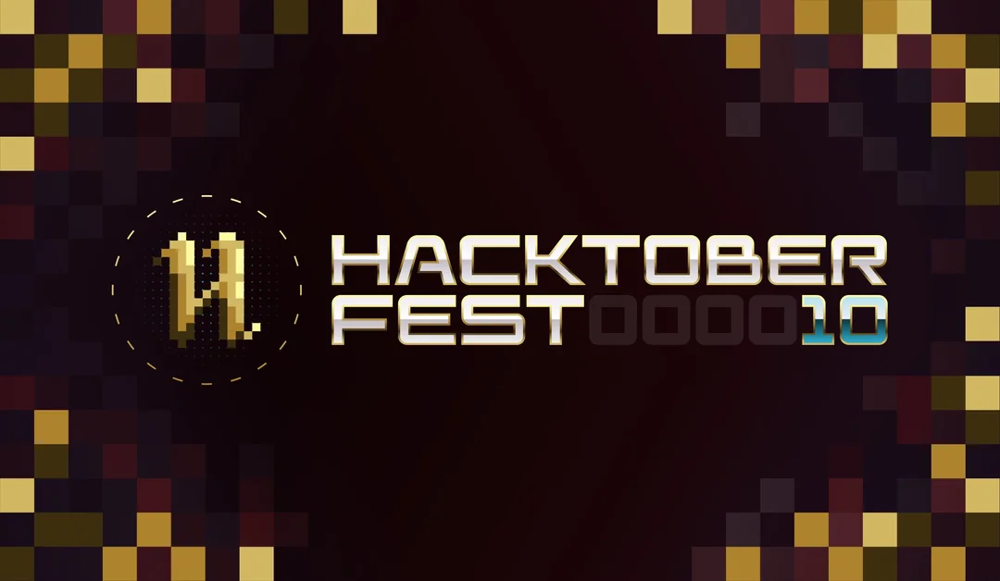

# HacktoberFest 2023 `GOOD FIRST` Pull Request - `Digital Rewards`🎉




# Contributors to Hacktoberfest 2023

<div align="center">

<a href="https://github.com/Ananyasingh2002/Hacktoberfest2023/graphs/contributors">
  
</a>
  
  </div>


# The Open Source Adventure Awaits! 🗺️

🌐 HacktoberFest is your gateway to the vibrant world of open source. This year marks the 10th anniversary of Hacktoberfest, and we’re calling on your support! Join us on this epic journey and earn yourself an exclusive digital reward kit from DigitalOcean and our sponsors and partners..

📢 Sign up for Hacktoberfest 2023, and contribute four pull requests (PRs) between October 1st-31st to claim your stash of cool SWAGS 🔥.

# [Visit this repository to contribute to a new project for Hacktoberfest 2023](https://github.com/Ananyasingh2002/OTP-Verification)

## [Click to Participate](https://hacktoberfest.com/participation/)

# Task 1.0

Welcome to our Hacktoberfest 2023 contributing website! We're excited to have you on board. Follow the steps below to contribute and add your name, picture, LinkedIn profile, and GitHub profile to our contributors' list.

## INSTRUCTIONS - Get Ready for the Adventure 🧭

- Fork this Repository using the button at the top on right corner.

  

- Clone your forked repository to your pc `git clone https://github.com/Ananyasingh2002/Hacktoberfest2023.git`

  

- Carve your own path with a new branch for your modifications (ie. `git branch new-user` and check it out `git checkout new-user` or simply do `git checkout -b new-user`)

- Leave your mark by adding your profile image to `images/` (drag and drop or upload with commands or by your name).

- Chronicle your legend by crafting your profile data in `participant/` (add your information here)

- Blaze your trail with these commands: `git add -A` or `git add .`, `git commit -m "added myself"`, and `git push origin new-explorer`

- Create a pull request

- Star this repository

# How To Make Your First Pull Request

## 1. Add your profile picture to the folder

Add a profile picture of your choice in `images/`. Accepted files are **png** and **jpg**, Ex.

```
images/<YOUR-USERNAME>.png
```

## 2. Add your profile information

Create a markdown file in your folder following the convention `participant/<YOUR-USERNAME>.md`. Ex.

```
participant/<YOUR-USERNAME>.md
```

Copy the next template into your file, delete the boilerplate data and fill the information with yours.

```
---
name: YOURNAME
institution/company: INSTITUTION_NAME
github:USERNAME
---
```

## 3. Wait for Pull Request to merge

## 4. Here is a quick reference guide for GitHub: [GitHub Guide](https://github.com/git-guides)

## 5. Celebrate - you've done your first pull request!!

- Aim to make more than 4 pull requests.
- Imagine you've only made 4 pull requests to different projects, but one of those projects isn't part of the Hacktoberfest event.
- In that case, your pull request won't be counted, leaving you with just 3 valid ones if those projects aren't excluded either.
- To ensure your success, I recommend making a pull request to your own repo, as long as it has the Hacktoberfest topic.

# Task 2.0

## Hacktoberfest 2023 Contribution Guide

Welcome to our Hacktoberfest 2023 contributing website! We're excited to have you on board. Follow the steps below to contribute and add your name, picture, LinkedIn profile, and GitHub profile to our contributors' list.

## Here is the link to the website: https://ananyasingh2002.github.io/Hacktoberfest2023/

## INSTRUCTIONS - Get Ready for the Adventure 🧭

- Fork this repository to your GitHub account by clicking the "Fork" button at the top right of this page.
  

- Clone your forked repository to your local machine. Replace `<your-username>` with your GitHub username:

  ```bash
  git clone https://github.com/Ananyasingh2002/Hacktoberfest2023.git
  ```

- Navigate to the project directory: `cd Hacktoberfest2023`

- Create a new branch for your changes. Replace <branch-name> with a descriptive branch name: `git checkout -b <branch-name>`

- Leave your mark by adding your profile image to `assets/images` (drag and drop or upload with commands or by your name).

- Chronicle your legend by crafting your profile data in `index.html and CSS(add your image address)` (add your information here)

- Blaze your trail with these commands: `git add -A` or `git add .`, `git commit -m "added myself"`, and `git push origin new-explorer`

- Create a pull request

- Star this repository

# How To Make Your First Pull Request

## 1. Add your profile picture to the folder

Add a picture picture of your choice in `assets/images/<YOUR-USERNAME>.png`. Accepted files are **png** and **jpg**, Ex.

```
assets/images/<YOUR-USERNAME>.png
```

## 2. Now, please navigate to the `index.html` file, open it, read the instructions in the code, copy down the line and add your information.


Enter your details here:


## 3. Change the class name below

```
<div class="card_img card1">
   <div class="plus"></div>
</div>
```


So, essentially, you are instructing the reader to change the class name of the first <div> element to include a number that corresponds to their specific use case. For instance, if their number is 2, the modified code would look like this:

```
<div class="card_img card2">
   <div class="plus"></div>
</div>
```


## 4. Now, please navigate to the `style.css` file, read the instructions, and add the class `.card(as your number is)` along with the image path.

`url('assets/images/<YOUR-USERNAME>.png')`


## 5. Wait for Pull Request to merge

## 6. Celebrate - you've done your first pull request!!

# + Follow Me: Swift Approval of Your Quest 🚀

To expedite approval of your pull request, (`Follow Me`)🚀

<tr><td align="center"><a href="https://github.com/Ananyasingh2002"><kbd></kbd><br /><sub><b>Ananya singh</b></sub></a><br /></td>

</tr>
